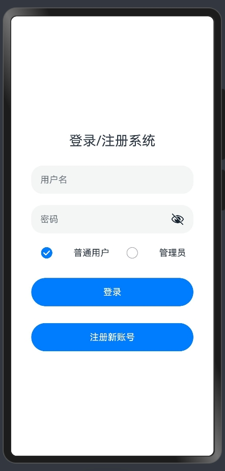
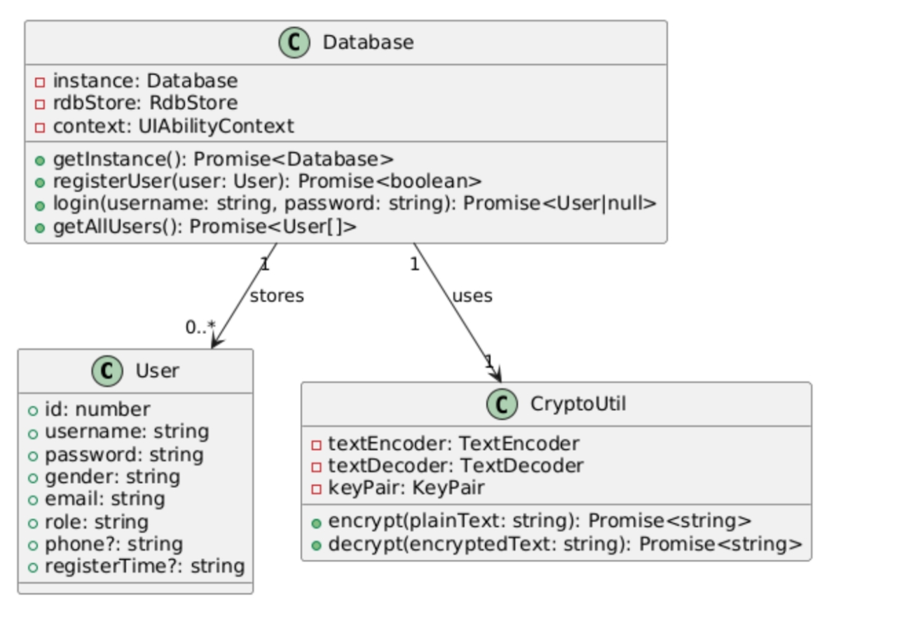
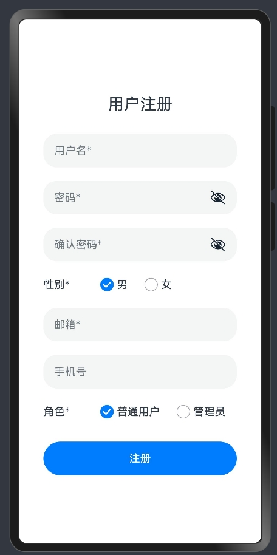
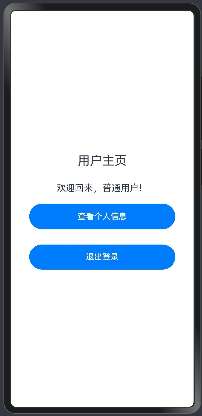
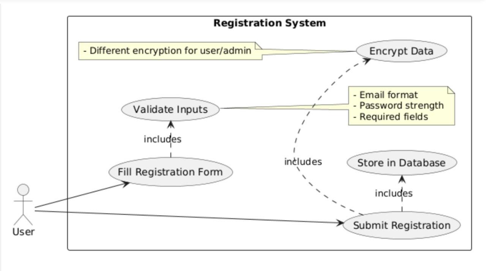
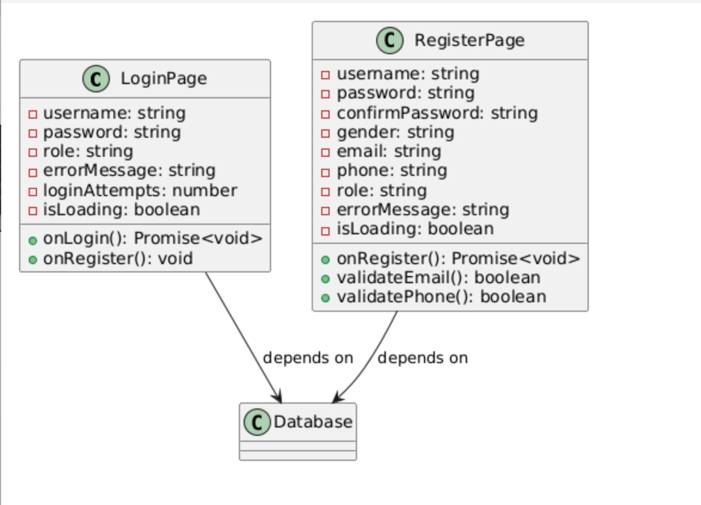
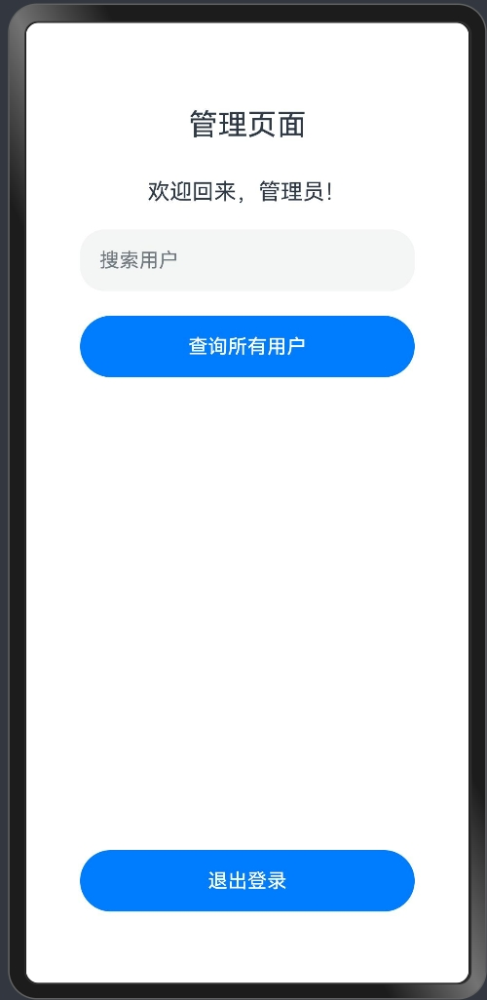
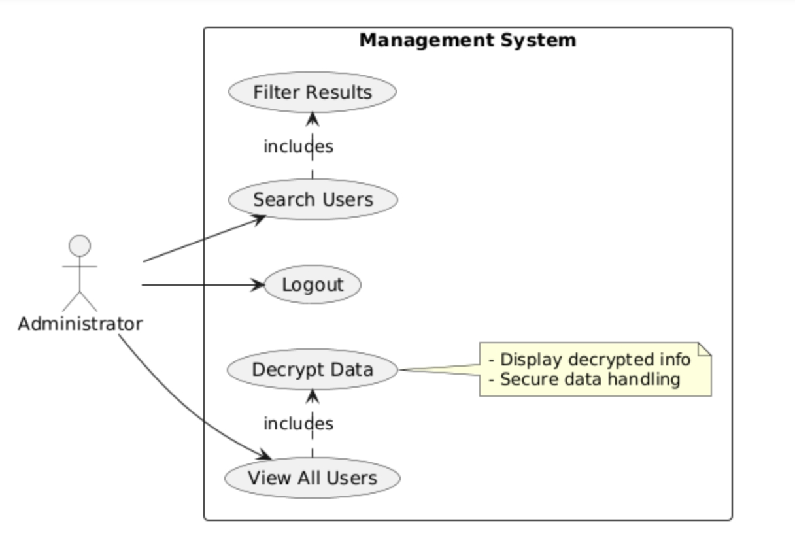
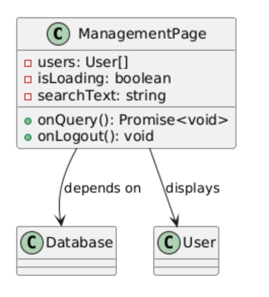

# 实验六报告

> 学号：<3225706004>
> 
> 姓名：<彭溪霖>
> 
> 指导老师：<张铠斌>
> 
> 实验日期：<2025-05-02>

## 一、实验目的

- 完成实验五中的L/R页面功能；
- 锻炼课堂所讲授的面向对象分析与设计能力；
- 实践编码能力

## 二、实验内容

- 依托教科书的第9章“数据管理”；
- 回顾实验三与实验四内容；
- 结合《课程指导》

完成本次实验。

## 三、实验要求

- Login/Registration System
  - 本次实验要求完成完整的登录/注册功能
- 基本需求
  - 三个UI Pages
    - L/R Page（实验五已进行）
      - 添加一个“角色”选项
        - 用户
        - 管理员
      - 输对用户名和密码后
        - 用户进入Home Page
        - 管理员进入Management Page
      - 如果登录信息不存在，提示进行“注册”
      - 连续3次输错密码后，关闭整个App
    - Registration Page
      - 引导用户输入注册信息
        - 用户名、性别、邮箱、密码、角色为必选项，其他自行设计
        - 需对用户输入内容进行形式判断，如数据类型等
          - 形式判断错误的，需要引导用户重新输入
      - 点击确认按钮后信息存入SQLite数据库
        - “用户”采用HarmonyOS的built-in加密存储功能
        - “管理员”采用自行加密模块处理后存储
    - Management Page
      - 此为管理员登录成功后可进入的页面
      - 具备“查询”按钮，点击返回整个注册数据库的信息
        - 跳转页面后用列表显示出来
          - 需解密后显示明文
  - 完成用例图和详细类图
    - 其他类型的图不要求
  - 完成编码实现
- 技术要求
  - 不能使用回调函数来完成异步编程，全部使用async/await形式
  - 必须有关键节点的日志输出


## 四、实验步骤

### 1. L/R Page

#### 1.1 截图展示



#### 1.2 用例图与类图




#### 1.3 代码实现

<在此处填写你的代码实现（带必要注释及Markdown语法高亮）>

插入代码的语法示例：
```typescript {.line-numbers}
/**
 * 登录页面，处理用户登录逻辑
 */
import { Database } from '../model/Database';
import { Logger } from '../utils/Logger';
import router from '@ohos.router';
import prompt from '@system.prompt';
import common from '@ohos.app.ability.common';

const TAG = 'LoginPage';

@Entry
@Component
struct LoginPage {
  @State username: string = '';       // 用户名
  @State password: string = '';       // 密码
  @State role: string = 'user';       // 角色
  @State errorMessage: string = '';   // 错误信息
  @State loginAttempts: number = 0;   // 登录尝试次数
  @State isLoading: boolean = false;  // 加载状态

  /**
   * 处理登录操作
   */
  async onLogin(): Promise<void> {
    // 表单验证
    if (!this.username.trim() || !this.password.trim()) {
      this.errorMessage = '用户名和密码不能为空';
      prompt.showToast({ message: this.errorMessage });
      return;
    }

    this.isLoading = true;
    this.errorMessage = '';

    try {
      // 获取数据库实例
      const context: common.UIAbilityContext = getContext() as common.UIAbilityContext;
      const db = await Database.getInstance(context);
      // 尝试登录
      const user = await db.login(this.username, this.password);

      if (!user) {
        this.loginAttempts++;
        if (this.loginAttempts >= 3) {
          Logger.warn(TAG, 'Too many failed login attempts');
          prompt.showToast({
            message: '登录失败次数过多，请稍后再试'
          });
          return;
        }
        this.errorMessage = '用户名或密码错误';
        prompt.showToast({ message: this.errorMessage });
        return;
      }

      Logger.info(TAG, `Login successful, role: ${user.role}`);

      // 根据角色跳转到不同页面
      const targetPage = user.role === 'admin' ? 'pages/ManagementPage' : 'pages/HomePage';
      try {
        await router.pushUrl({
          url: targetPage,
          params: { username: this.username } // 可选：传递参数
        });
      } catch (err) {
        Logger.error(TAG, `Navigation error: ${JSON.stringify(err)}`);
        prompt.showToast({ message: '页面跳转失败，请重试' });
      }
    } catch (err) {
      Logger.error(TAG, `Login error: ${JSON.stringify(err)}`);
      this.errorMessage = '登录过程中发生错误';
      prompt.showToast({ message: this.errorMessage });
    } finally {
      this.isLoading = false;
    }
  }

  /**
   * 跳转到注册页面
   */
  onRegister(): void {
    router.pushUrl({ url: 'pages/RegisterPage' })
      .catch((err: Error) => {
        Logger.error(TAG, `Register navigation error: ${JSON.stringify(err)}`);
        prompt.showToast({ message: '无法打开注册页面' });
      });
  }

  build() {
    Column() {
      Text('登录/注册系统')
        .fontSize(24)
        .margin(20);

      // 用户名输入框
      TextInput({ placeholder: '用户名' })
        .width('80%')
        .height(50)
        .margin(10)
        .onChange((value: string) => {
          this.username = value;
        });

      // 密码输入框
      TextInput({ placeholder: '密码' })
        .width('80%')
        .height(50)
        .margin(10)
        .type(InputType.Password)
        .onChange((value: string) => {
          this.password = value;
        });

      // 角色选择
      Row() {
        Radio({ value: 'user', group: 'role' })
          .checked(this.role === 'user')
          .onChange((isChecked: boolean) => {
            if (isChecked) this.role = 'user';
          });
        Text('普通用户')
          .fontSize(16)
          .margin({ left: 8 });

        Radio({ value: 'admin', group: 'role' })
          .checked(this.role === 'admin')
          .onChange((isChecked: boolean) => {
            if (isChecked) this.role = 'admin';
          });
        Text('管理员')
          .fontSize(16)
          .margin({ left: 8 });
      }
      .width('80%')
      .margin(10)
      .justifyContent(FlexAlign.SpaceAround);

      // 错误信息显示
      if (this.errorMessage) {
        Text(this.errorMessage)
          .fontSize(14)
          .fontColor('#ff0000')
          .margin(10);
      }

      // 加载状态显示
      if (this.isLoading) {
        LoadingProgress()
          .width(50)
          .height(50)
          .margin(20);
      } else {
        Button('登录')
          .width('80%')
          .height(50)
          .margin(20)
          .onClick(() => {
            this.onLogin();
          });
      }

      // 注册按钮
      Button('注册新账号')
        .width('80%')
        .height(50)
        .margin(10)
        .onClick(() => {
          this.onRegister();
        });
    }
    .width('100%')
    .height('100%')
    .justifyContent(FlexAlign.Center);
  }
}
```


### 2. Registration Page

#### 2.1 截图展示






#### 2.2 用例图与类图




#### 2.3 代码实现

<在此处填写你的代码实现（带必要注释及Markdown语法高亮）>

插入代码的语法示例：
```typescript {.line-numbers}

/**
 * 注册页面，处理新用户注册
 */
import { Database } from '../model/Database';
import { User } from '../model/User';
import { Logger } from '../utils/Logger';
import router from '@ohos.router';
import common from '@ohos.app.ability.common';
import prompt from '@system.prompt';

const TAG = 'RegisterPage';

@Entry
@Component
struct RegisterPage {
  @State username: string = '';       // 用户名
  @State password: string = '';       // 密码
  @State confirmPassword: string = ''; // 确认密码
  @State gender: string = 'male';     // 性别
  @State email: string = '';          // 邮箱
  @State phone: string = '';          // 手机号
  @State role: string = 'user';       // 角色
  @State errorMessage: string = '';   // 错误信息
  @State isLoading: boolean = false;  // 加载状态

  /**
   * 处理注册操作
   */
  async onRegister(): Promise<void> {
    // 表单验证
    if (!this.username.trim() || !this.password.trim() ||
      !this.confirmPassword.trim() || !this.email.trim()) {
      this.errorMessage = '请填写所有必填字段';
      prompt.showToast({ message: this.errorMessage });
      return;
    }

    if (this.password !== this.confirmPassword) {
      this.errorMessage = '两次输入的密码不一致';
      prompt.showToast({ message: this.errorMessage });
      return;
    }

    if (!this.validateEmail(this.email)) {
      this.errorMessage = '请输入有效的邮箱地址';
      prompt.showToast({ message: this.errorMessage });
      return;
    }

    if (this.phone && !this.validatePhone(this.phone)) {
      this.errorMessage = '请输入有效的手机号码';
      prompt.showToast({ message: this.errorMessage });
      return;
    }

    this.isLoading = true;
    this.errorMessage = '';

    try {
      // 获取数据库实例
      const context: common.UIAbilityContext = getContext() as common.UIAbilityContext;
      const db = await Database.getInstance(context);
      // 创建用户对象
      const user = new User(
        this.username,
        this.password,
        this.gender,
        this.email,
        this.role,
        this.phone
      );

      // 注册用户
      const success = await db.registerUser(user);
      if (success) {
        Logger.info(TAG, `User ${this.username} registered successfully`);
        prompt.showToast({ message: '注册成功' });
        router.back();
      } else {
        this.errorMessage = '注册失败，用户名可能已存在';
        prompt.showToast({ message: this.errorMessage });
      }
    } catch (err) {
      Logger.error(TAG, `Registration error: ${JSON.stringify(err)}`);
      this.errorMessage = '注册过程中发生错误';
      prompt.showToast({ message: this.errorMessage });
    } finally {
      this.isLoading = false;
    }
  }

  /**
   * 验证邮箱格式
   * @param email 邮箱地址
   * @returns 是否有效
   */
  validateEmail(email: string): boolean {
    const re = /^[^\s@]+@[^\s@]+\.[^\s@]+$/;
    return re.test(email);
  }

  /**
   * 验证手机号格式
   * @param phone 手机号
   * @returns 是否有效
   */
  validatePhone(phone: string): boolean {
    const re = /^1[3-9]\d{9}$/;
    return re.test(phone);
  }

  build() {
    Column() {
      Text('用户注册')
        .fontSize(24)
        .margin(20);

      // 用户名输入框
      TextInput({ placeholder: '用户名*' })
        .width('80%')
        .height(50)
        .margin(10)
        .onChange((value: string) => {
          this.username = value;
        });

      // 密码输入框
      TextInput({ placeholder: '密码*' })
        .width('80%')
        .height(50)
        .margin(10)
        .type(InputType.Password)
        .onChange((value: string) => {
          this.password = value;
        });

      // 确认密码输入框
      TextInput({ placeholder: '确认密码*' })
        .width('80%')
        .height(50)
        .margin(10)
        .type(InputType.Password)
        .onChange((value: string) => {
          this.confirmPassword = value;
        });

      // 性别选择
      Row() {
        Text('性别*')
          .width(80)
          .fontSize(16);
        Radio({ value: 'male', group: 'gender' })
          .checked(this.gender === 'male')
          .onChange((isChecked: boolean) => {
            if(isChecked) this.gender = 'male';
          });
        Text('男')
          .fontSize(16)
          .margin({ right: 20 });

        Radio({ value: 'female', group: 'gender' })
          .checked(this.gender === 'female')
          .onChange((isChecked: boolean) => {
            if (isChecked) this.gender = 'female';
          });
        Text('女')
          .fontSize(16);
      }
      .width('80%')
      .margin(10);

      TextInput({ placeholder: '邮箱*' })
        .width('80%')
        .height(50)
        .margin(10)
        .onChange((value: string) => {
          this.email = value;
        });

      TextInput({ placeholder: '手机号' })
        .width('80%')
        .height(50)
        .margin(10)
        .onChange((value: string) => {
          this.phone = value;
        });

      Row() {
        Text('角色*')
          .width(80)
          .fontSize(16);
        Radio({ value: 'user', group: 'role' })
          .checked(this.role === 'user')
          .onChange((isChecked: boolean) => {
            if (isChecked) this.role = 'user';
          });
        Text('普通用户')
          .fontSize(16)
          .margin({ right: 20 });

        Radio({ value: 'admin', group: 'role' })
          .checked(this.role === 'admin')
          .onChange((isChecked: boolean) => {
            if (isChecked) this.role = 'admin';
          });
        Text('管理员')
          .fontSize(16);
      }
      .width('80%')
      .margin(10);

      if (this.errorMessage) {
        Text(this.errorMessage)
          .fontSize(14)
          .fontColor('#ff0000')
          .margin(10);
      }

      if (this.isLoading) {
        // 使用ArkUI内置的加载指示器替代方案
        Row() {
          Image($r('app.media.background')) // 使用自定义加载图标
            .width(40)
            .height(40)
            .margin(10);
          Text('注册中...')
            .fontSize(16);
        }
        .width('100%')
        .height(60)
        .justifyContent(FlexAlign.Center)
        .margin(20);
      } else {
        Button('注册')
          .width('80%')
          .height(50)
          .margin(20)
          .onClick(() => {
            this.onRegister();
          });
      }
    }
    .width('100%')
    .height('100%')
    .justifyContent(FlexAlign.Center);
  }
}

```
```typescript {.line-numbers}

/**
 * 用户主页，普通用户登录后显示的页面
 */
import router from '@ohos.router';
import { Logger } from '../utils/Logger';
import prompt from '@system.prompt';

const TAG = 'HomePage';

@Entry
@Component
struct HomePage {
  /**
   * 处理退出登录操作
   */
  onLogout() {
    Logger.info(TAG, 'User logged out');
    router.back();
  }

  build() {
    Column() {
      Text('用户主页').fontSize(24).margin(20)
      Text('欢迎回来，普通用户！').fontSize(18).margin(10)

      Button('查看个人信息')
        .width('80%')
        .height(50)
        .margin(10)
        .onClick(() => {
          prompt.showToast({ message: '功能开发中' });
        })

      Button('退出登录')
        .width('80%')
        .height(50)
        .margin(20)
        .onClick(() => {
          this.onLogout();
        })
    }
    .width('100%')
    .height('100%')
    .justifyContent(FlexAlign.Center)
  }
}

```
```typescript {.line-numbers}
/**
 * 用户模型类，表示系统中的用户
 */
export class User {
  id?: number;          // 自增ID
  username: string;     // 用户名
  password: string;     // 加密后的密码
  gender: string;       // 性别
  email: string;        // 邮箱
  role: string;         // 角色(user/admin)
  phone?: string;       // 手机号(可选)
  registerTime?: string; // 注册时间

  /**
   * 构造函数
   * @param username 用户名
   * @param password 密码
   * @param gender 性别
   * @param email 邮箱
   * @param role 角色
   * @param phone 手机号(可选)
   */
  constructor(username: string, password: string, gender: string,
    email: string, role: string, phone?: string) {
    this.username = username;
    this.password = password;
    this.gender = gender;
    this.email = email;
    this.role = role;
    this.phone = phone;
    this.registerTime = new Date().toISOString();
  }
}
```
```typescript {.line-numbers}

/**
 * 数据库操作类，提供用户数据的增删改查功能
 * 使用关系型数据库存储用户信息
 */
import relationalStore from '@ohos.data.relationalStore';
import { User } from './User';
import { CryptoUtil } from './CryptoUtil';
import { Logger } from '../utils/Logger';
import common from '@ohos.app.ability.common';

const TAG = 'Database';
const DB_NAME = 'user_db.db';
const TABLE_NAME = 'users';

// 数据库配置
interface StoreConfig {
  name: string;
  securityLevel: relationalStore.SecurityLevel;
}

const STORE_CONFIG: StoreConfig = {
  name: DB_NAME,
  securityLevel: relationalStore.SecurityLevel.S1
};

export class Database {
  // 单例实例
  private static instance: Database;
  // 数据库存储对象
  private rdbStore: relationalStore.RdbStore | null = null;
  // 上下文
  private context: common.UIAbilityContext;

  // 私有构造函数
  private constructor(context: common.UIAbilityContext) {
    this.context = context;
  }

  /**
   * 获取数据库单例实例
   * @param context 上下文对象
   * @returns 数据库实例
   */
  public static async getInstance(context: common.UIAbilityContext): Promise<Database> {
    if (!Database.instance) {
      Database.instance = new Database(context);
      await Database.instance.init();
    }
    return Database.instance;
  }

  /**
   * 初始化数据库
   * @throws 如果初始化失败则抛出错误
   */
  private async init(): Promise<void> {
    try {
      // 获取或创建数据库
      this.rdbStore = await relationalStore.getRdbStore(this.context, STORE_CONFIG);
      // 创建表
      await this.createTable();
      Logger.info(TAG, 'Database initialized successfully');
    } catch (err) {
      Logger.error(TAG, `Failed to initialize database: ${err instanceof Error ? err.message : JSON.stringify(err)}`);
      throw new Error('Database initialization failed');
    }
  }

  /**
   * 创建用户表
   * @throws 如果表创建失败则抛出错误
   */
  private async createTable(): Promise<void> {
    if (!this.rdbStore) {
      throw new Error('RdbStore is not initialized');
    }

    // SQL建表语句
    const sql = `CREATE TABLE IF NOT EXISTS ${TABLE_NAME} (
      id INTEGER PRIMARY KEY AUTOINCREMENT,
      username TEXT NOT NULL UNIQUE,
      password TEXT NOT NULL,
      gender TEXT NOT NULL,
      email TEXT NOT NULL,
      role TEXT NOT NULL,
      phone TEXT,
      registerTime TEXT DEFAULT (strftime('%Y-%m-%d %H:%M:%S', 'now', 'localtime'))
    )`;

    try {
      await this.rdbStore.executeSql(sql);
      Logger.info(TAG, 'Table created or already exists');
    } catch (err) {
      Logger.error(TAG, `Failed to create table: ${err instanceof Error ? err.message : JSON.stringify(err)}`);
      throw new Error('Table creation failed');
    }
  }

  /**
   * 注册用户
   * @param user 用户对象
   * @returns 注册是否成功
   */
  public async registerUser(user: User): Promise<boolean> {
    if (!this.rdbStore) {
      throw new Error('Database not initialized');
    }

    try {
      // 加密密码
      const encryptedPassword = await CryptoUtil.encrypt(user.password);

      // 准备插入数据
      const valueBucket: relationalStore.ValuesBucket = {
        'username': user.username,
        'password': encryptedPassword,
        'gender': user.gender,
        'email': user.email,
        'role': user.role,
        'phone': user.phone || null
      };

      // 执行插入
      await this.rdbStore.insert(TABLE_NAME, valueBucket);
      Logger.info(TAG, `User ${user.username} registered successfully`);
      return true;
    } catch (err) {
      Logger.error(TAG, `Failed to register user: ${err instanceof Error ? err.message : JSON.stringify(err)}`);
      return false;
    }
  }

  /**
   * 用户登录
   * @param username 用户名
   * @param password 密码
   * @returns 登录成功的用户对象，失败返回null
   */
  public async login(username: string, password: string): Promise<User | null> {
    if (!this.rdbStore) {
      throw new Error('Database not initialized');
    }

    try {
      // 构建查询条件
      const predicates = new relationalStore.RdbPredicates(TABLE_NAME);
      predicates.equalTo('username', username);

      // 执行查询
      const resultSet = await this.rdbStore.query(predicates, [
        'id', 'username', 'password', 'role',
        'gender', 'email', 'phone', 'registerTime'
      ]);

      // 检查用户是否存在
      if (resultSet.rowCount <= 0) {
        Logger.info(TAG, 'User not found');
        return null;
      }

      // 获取第一行数据
      await resultSet.goToFirstRow();
      const encryptedPassword = resultSet.getString(resultSet.getColumnIndex('password')) ?? '';

      // 解密密码
      const decryptedPassword = await CryptoUtil.decrypt(encryptedPassword);

      // 验证密码
      if (decryptedPassword !== password) {
        Logger.info(TAG, 'Password mismatch');
        return null;
      }

      // 构建用户对象
      const user = new User(
        resultSet.getString(resultSet.getColumnIndex('username')) ?? '',
        encryptedPassword, // 存储加密后的密码
        resultSet.getString(resultSet.getColumnIndex('gender')) ?? 'male',
        resultSet.getString(resultSet.getColumnIndex('email')) ?? '',
        resultSet.getString(resultSet.getColumnIndex('role')) ?? 'user',
        resultSet.getString(resultSet.getColumnIndex('phone')) ?? ''
      );

      // 设置额外属性
      user.id = resultSet.getLong(resultSet.getColumnIndex('id'));
      user.registerTime = resultSet.getString(resultSet.getColumnIndex('registerTime')) ?? '';

      Logger.info(TAG, `User ${username} logged in successfully`);
      return user;
    } catch (err) {
      Logger.error(TAG, `Login failed: ${err instanceof Error ? err.message : JSON.stringify(err)}`);
      return null;
    }
  }

  /**
   * 获取所有用户
   * @returns 用户数组
   */
  public async getAllUsers(): Promise<User[]> {
    if (!this.rdbStore) {
      throw new Error('Database not initialized');
    }

    const users: User[] = [];
    try {
      // 查询所有用户
      const predicates = new relationalStore.RdbPredicates(TABLE_NAME);
      const resultSet = await this.rdbStore.query(predicates, [
        'id', 'username', 'password', 'role',
        'gender', 'email', 'phone', 'registerTime'
      ]);

      // 遍历结果集
      while (resultSet.goToNextRow()) {
        const user = new User(
          resultSet.getString(resultSet.getColumnIndex('username')) ?? '',
          resultSet.getString(resultSet.getColumnIndex('password')) ?? '',
          resultSet.getString(resultSet.getColumnIndex('gender')) ?? 'male',
          resultSet.getString(resultSet.getColumnIndex('email')) ?? '',
          resultSet.getString(resultSet.getColumnIndex('role')) ?? 'user',
          resultSet.getString(resultSet.getColumnIndex('phone')) ?? ''
        );

        // 设置额外属性
        user.id = resultSet.getLong(resultSet.getColumnIndex('id'));
        user.registerTime = resultSet.getString(resultSet.getColumnIndex('registerTime')) ?? '';
        users.push(user);
      }

      Logger.info(TAG, `Fetched ${users.length} users`);
      return users;
    } catch (err) {
      Logger.error(TAG, `Failed to get all users: ${err instanceof Error ? err.message : JSON.stringify(err)}`);
      return [];
    }
  }
}


```

### 3. Management Page

#### 3.1 截图展示




#### 3.2 用例图与类图




#### 3.3 代码实现

<在此处填写你的代码实现（带必要注释及Markdown语法高亮）>

插入代码的语法示例：
```typescript {.line-numbers}

/**
 * 管理页面，管理员登录后显示的页面
 */
import { Database } from '../model/Database';
import { User } from '../model/User';
import { Logger } from '../utils/Logger';
import router from '@ohos.router';
import common from '@ohos.app.ability.common';
import prompt from '@system.prompt';

const TAG = 'ManagementPage';

@Entry
@Component
struct ManagementPage {
  @State users: Array<User> = [];   // 用户列表
  @State isLoading: boolean = false; // 加载状态
  @State searchText: string = '';   // 搜索文本

  /**
   * 查询所有用户
   */
  async onQuery(): Promise<void> {
    this.isLoading = true;
    try {
      // 获取数据库实例
      const context: common.UIAbilityContext = getContext() as common.UIAbilityContext;
      const db = await Database.getInstance(context);
      // 获取所有用户
      const allUsers = await db.getAllUsers();

      // 过滤搜索结果
      this.users = allUsers.filter(user =>
        user.username.toLowerCase().includes(this.searchText.toLowerCase()) ||
        user.email.toLowerCase().includes(this.searchText.toLowerCase())
      );

      Logger.info(TAG, `Loaded ${this.users.length} users`);
    } catch (err) {
      Logger.error(TAG, `Failed to query users: ${JSON.stringify(err)}`);
      prompt.showToast({ message: '获取用户数据失败' });
    } finally {
      this.isLoading = false;
    }
  }

  /**
   * 处理退出登录操作
   */
  onLogout(): void {
    Logger.info(TAG, 'Admin logged out');
    router.back();
  }

  build() {
    Column() {
      Text('管理页面')
        .fontSize(24)
        .margin(20);

      Text('欢迎回来，管理员！')
        .fontSize(18)
        .margin(10);

      // 搜索框
      TextInput({ placeholder: '搜索用户' })
        .width('80%')
        .height(50)
        .margin(10)
        .onChange((value: string) => {
          this.searchText = value;
        });

      // 查询按钮
      Button('查询所有用户')
        .width('80%')
        .height(50)
        .margin(10)
        .onClick(() => {
          this.onQuery();
        });

      // 加载状态显示
      if (this.isLoading) {
        Row() {
          Image($r('app.media.background')) // 使用自定义加载图标
            .width(40)
            .height(40)
            .margin(10)
          Text('加载中...')
            .fontSize(16)
        }
        .width('100%')
        .height(60)
        .justifyContent(FlexAlign.Center)
        .margin(20);
      } else {
        // 用户列表
        List({ space: 10 }) {
          ForEach(this.users, (user: User) => {
            ListItem() {
              Column() {
                Text(`用户名: ${user.username}`)
                  .fontSize(16);
                Text(`角色: ${user.role}`)
                  .fontSize(14);
                Text(`邮箱: ${user.email}`)
                  .fontSize(14);
                Text(`性别: ${user.gender}`)
                  .fontSize(14);
                if (user.phone) {
                  Text(`电话: ${user.phone}`)
                    .fontSize(14);
                }
                Text(`注册时间: ${user.registerTime}`)
                  .fontSize(12)
                  .fontColor('#666');
              }
              .width('100%')
              .padding(10)
              .backgroundColor('#f5f5f5')
              .borderRadius(8);
            }
          });
        }
        .width('100%')
        .height('calc(100% - 250px)')
        .layoutWeight(1)
        .margin(10);
      }

      // 退出登录按钮
      Button('退出登录')
        .width('80%')
        .height(50)
        .margin(20)
        .onClick(() => {
          this.onLogout();
        });
    }
    .width('100%')
    .height('100%')
    .padding(10);
  }
}

```
```typescript {.line-numbers}

/**
 * 加密工具类，提供RSA加密解密功能
 * 使用RSA1024|PKCS1算法进行加密
 * 包含Base64编码解码功能
 */
import cryptoFramework from '@ohos.security.cryptoFramework';
import { Logger } from '../utils/Logger';
import { util } from '@kit.ArkTS';

const TAG = 'CryptoUtil';

export class CryptoUtil {
  // 文本编码解码器
  private static textEncoder = new util.TextEncoder();
  private static textDecoder = new util.TextDecoder();
  
  // 存储密钥对
  private static keyPair: cryptoFramework.KeyPair | null = null;

  /**
   * 确保密钥对存在，如果不存在则生成新的密钥对
   * @throws 如果密钥生成失败则抛出错误
   */
  private static async ensureKeyPair(): Promise<void> {
    if (!CryptoUtil.keyPair) {
      try {
        // 创建RSA密钥生成器
        const keyGenerator = cryptoFramework.createAsyKeyGenerator('RSA1024|PKCS1');
        // 生成密钥对
        CryptoUtil.keyPair = await keyGenerator.generateKeyPair();
        Logger.info(TAG, 'Key pair generated and stored');
      } catch (err) {
        Logger.error(TAG, `Key generation failed: ${err instanceof Error ? err.message : 'Unknown error'}`);
        throw new Error('Key generation failed');
      }
    }
  }

  /**
   * 加密文本
   * @param plainText 要加密的明文
   * @returns 加密后的Base64字符串
   * @throws 如果加密失败则抛出错误
   */
  public static async encrypt(plainText: string): Promise<string> {
    await CryptoUtil.ensureKeyPair();
    try {
      // 创建加密器
      const cipher = cryptoFramework.createCipher('RSA1024|PKCS1');
      // 初始化加密器
      await cipher.init(cryptoFramework.CryptoMode.ENCRYPT_MODE, CryptoUtil.keyPair!.pubKey, null);

      // 准备输入数据
      const input: cryptoFramework.DataBlob = {
        data: CryptoUtil.textEncoder.encode(plainText)
      };

      // 执行加密
      const output = await cipher.doFinal(input);
      // 返回Base64编码结果
      return CryptoUtil.uint8ArrayToBase64(output.data);
    } catch (err) {
      Logger.error(TAG, `Encrypt failed: ${err instanceof Error ? err.message : 'Unknown error'}`);
      throw new Error('Encryption failed');
    }
  }

  /**
   * 解密文本
   * @param encryptedText 要解密的Base64字符串
   * @returns 解密后的明文
   * @throws 如果解密失败则抛出错误
   */
  public static async decrypt(encryptedText: string): Promise<string> {
    await CryptoUtil.ensureKeyPair();
    try {
      // 创建解密器
      const cipher = cryptoFramework.createCipher('RSA1024|PKCS1');
      // 初始化解密器
      await cipher.init(cryptoFramework.CryptoMode.DECRYPT_MODE, CryptoUtil.keyPair!.priKey, null);

      // 准备输入数据
      const input: cryptoFramework.DataBlob = {
        data: CryptoUtil.base64ToUint8Array(encryptedText)
      };

      // 执行解密
      const output = await cipher.doFinal(input);
      // 返回解码后的文本
      return CryptoUtil.textDecoder.decode(output.data);
    } catch (err) {
      Logger.error(TAG, `Decrypt failed: ${err instanceof Error ? err.message : 'Unknown error'}`);
      throw new Error('Decryption failed');
    }
  }

  /**
   * 将Uint8Array转换为Base64字符串
   * @param buffer 要转换的Uint8Array
   * @returns Base64编码的字符串
   */
  private static uint8ArrayToBase64(buffer: Uint8Array): string {
    const base64Chars = 'ABCDEFGHIJKLMNOPQRSTUVWXYZabcdefghijklmnopqrstuvwxyz0123456789+/';
    let result = '';

    // 每3个字节一组进行处理
    for (let i = 0; i < buffer.length; i += 3) {
      const byte1 = buffer[i];
      const byte2 = i + 1 < buffer.length ? buffer[i + 1] : 0;
      const byte3 = i + 2 < buffer.length ? buffer[i + 2] : 0;

      // 转换为4个Base64字符
      const char1 = byte1 >> 2;
      const char2 = ((byte1 & 3) << 4) | (byte2 >> 4);
      const char3 = ((byte2 & 15) << 2) | (byte3 >> 6);
      const char4 = byte3 & 63;

      // 拼接结果
      result += base64Chars.charAt(char1) + base64Chars.charAt(char2) +
        (i + 1 < buffer.length ? base64Chars.charAt(char3) : '=') +
        (i + 2 < buffer.length ? base64Chars.charAt(char4) : '=');
    }

    return result;
  }

  /**
   * 将Base64字符串转换为Uint8Array
   * @param base64Str 要转换的Base64字符串
   * @returns 解码后的Uint8Array
   */
  private static base64ToUint8Array(base64Str: string): Uint8Array {
    const base64Chars = 'ABCDEFGHIJKLMNOPQRSTUVWXYZabcdefghijklmnopqrstuvwxyz0123456789+/';
    // 移除末尾的等号
    base64Str = base64Str.replace(/=+$/, '');
    // 创建输出缓冲区
    const output = new Uint8Array(Math.floor(base64Str.length * 3 / 4));
    let outputIndex = 0;

    // 每4个字符一组进行处理
    for (let i = 0; i < base64Str.length; i += 4) {
      const char1 = base64Chars.indexOf(base64Str.charAt(i));
      const char2 = base64Chars.indexOf(base64Str.charAt(i + 1));
      const char3 = base64Chars.indexOf(base64Str.charAt(i + 2));
      const char4 = base64Chars.indexOf(base64Str.charAt(i + 3));

      // 组合为24位
      const group = (char1 << 18) | (char2 << 12) | ((char3 & 63) << 6) | (char4 & 63);

      // 转换为3个字节
      output[outputIndex++] = (group >> 16) & 255;
      if (char3 !== -1) output[outputIndex++] = (group >> 8) & 255;
      if (char4 !== -1) output[outputIndex++] = group & 255;
    }

    return output;
  }
}

```
