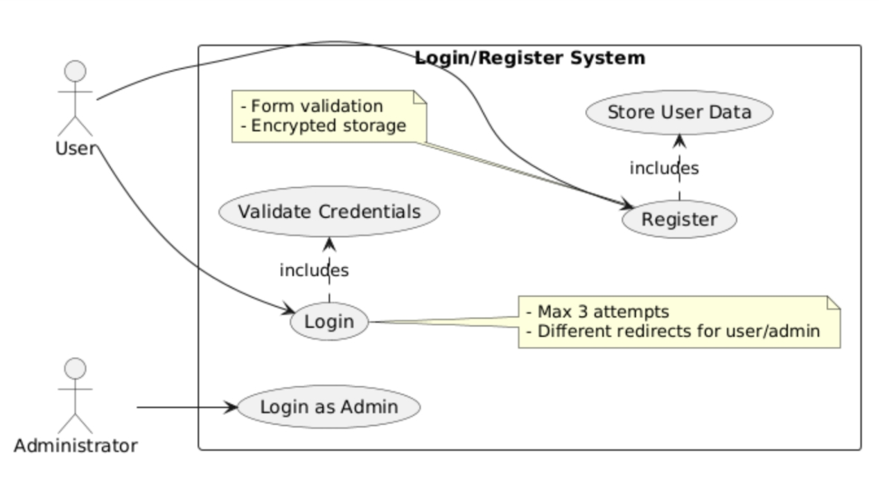

# 实验六报告

> 学号：<学号>
> 
> 姓名：<姓名>
> 
> 指导老师：<指导老师>
> 
> 实验日期：<20XX-XX-XX>

## 一、实验目的

- 完成实验五中的L/R页面功能；
- 锻炼课堂所讲授的面向对象分析与设计能力；
- 实践编码能力

## 二、实验内容

- 依托教科书的第9章“数据管理”；
- 回顾实验三与实验四内容；
- 结合《课程指导》

完成本次实验。

## 三、实验要求

- Login/Registration System
  - 本次实验要求完成完整的登录/注册功能
- 基本需求
  - 三个UI Pages
    - L/R Page（实验五已进行）
      - 添加一个“角色”选项
        - 用户
        - 管理员
      - 输对用户名和密码后
        - 用户进入Home Page
        - 管理员进入Management Page
      - 如果登录信息不存在，提示进行“注册”
      - 连续3次输错密码后，关闭整个App
    - Registration Page
      - 引导用户输入注册信息
        - 用户名、性别、邮箱、密码、角色为必选项，其他自行设计
        - 需对用户输入内容进行形式判断，如数据类型等
          - 形式判断错误的，需要引导用户重新输入
      - 点击确认按钮后信息存入SQLite数据库
        - “用户”采用HarmonyOS的built-in加密存储功能
        - “管理员”采用自行加密模块处理后存储
    - Management Page
      - 此为管理员登录成功后可进入的页面
      - 具备“查询”按钮，点击返回整个注册数据库的信息
        - 跳转页面后用列表显示出来
          - 需解密后显示明文
  - 完成用例图和详细类图
    - 其他类型的图不要求
  - 完成编码实现
- 技术要求
  - 不能使用回调函数来完成异步编程，全部使用async/await形式
  - 必须有关键节点的日志输出


## 四、实验步骤

### 1. L/R Page

#### 1.1 截图展示


#### 1.2 用例图与类图




#### 1.3 代码实现

<在此处填写你的代码实现（带必要注释及Markdown语法高亮）>

插入代码的语法示例：
```typescript {.line-numbers}
/**
 * 登录页面，处理用户登录逻辑
 */
import { Database } from '../model/Database';
import { Logger } from '../utils/Logger';
import router from '@ohos.router';
import prompt from '@system.prompt';
import common from '@ohos.app.ability.common';

const TAG = 'LoginPage';

@Entry
@Component
struct LoginPage {
  @State username: string = '';       // 用户名
  @State password: string = '';       // 密码
  @State role: string = 'user';       // 角色
  @State errorMessage: string = '';   // 错误信息
  @State loginAttempts: number = 0;   // 登录尝试次数
  @State isLoading: boolean = false;  // 加载状态

  /**
   * 处理登录操作
   */
  async onLogin(): Promise<void> {
    // 表单验证
    if (!this.username.trim() || !this.password.trim()) {
      this.errorMessage = '用户名和密码不能为空';
      prompt.showToast({ message: this.errorMessage });
      return;
    }

    this.isLoading = true;
    this.errorMessage = '';

    try {
      // 获取数据库实例
      const context: common.UIAbilityContext = getContext() as common.UIAbilityContext;
      const db = await Database.getInstance(context);
      // 尝试登录
      const user = await db.login(this.username, this.password);

      if (!user) {
        this.loginAttempts++;
        if (this.loginAttempts >= 10) {
          Logger.warn(TAG, 'Too many failed login attempts');
          prompt.showToast({
            message: '登录失败次数过多，请稍后再试'
          });
          return;
        }
        this.errorMessage = '用户名或密码错误';
        prompt.showToast({ message: this.errorMessage });
        return;
      }

      Logger.info(TAG, `Login successful, role: ${user.role}`);

      // 根据角色跳转到不同页面
      const targetPage = user.role === 'admin' ? 'pages/ManagementPage' : 'pages/HomePage';
      try {
        await router.pushUrl({
          url: targetPage,
          params: { username: this.username } // 可选：传递参数
        });
      } catch (err) {
        Logger.error(TAG, `Navigation error: ${JSON.stringify(err)}`);
        prompt.showToast({ message: '页面跳转失败，请重试' });
      }
    } catch (err) {
      Logger.error(TAG, `Login error: ${JSON.stringify(err)}`);
      this.errorMessage = '登录过程中发生错误';
      prompt.showToast({ message: this.errorMessage });
    } finally {
      this.isLoading = false;
    }
  }

  /**
   * 跳转到注册页面
   */
  onRegister(): void {
    router.pushUrl({ url: 'pages/RegisterPage' })
      .catch((err: Error) => {
        Logger.error(TAG, `Register navigation error: ${JSON.stringify(err)}`);
        prompt.showToast({ message: '无法打开注册页面' });
      });
  }

  build() {
    Column() {
      Text('登录/注册系统')
        .fontSize(24)
        .margin(20);

      // 用户名输入框
      TextInput({ placeholder: '用户名' })
        .width('80%')
        .height(50)
        .margin(10)
        .onChange((value: string) => {
          this.username = value;
        });

      // 密码输入框
      TextInput({ placeholder: '密码' })
        .width('80%')
        .height(50)
        .margin(10)
        .type(InputType.Password)
        .onChange((value: string) => {
          this.password = value;
        });

      // 角色选择
      Row() {
        Radio({ value: 'user', group: 'role' })
          .checked(this.role === 'user')
          .onChange((isChecked: boolean) => {
            if (isChecked) this.role = 'user';
          });
        Text('普通用户')
          .fontSize(16)
          .margin({ left: 8 });

        Radio({ value: 'admin', group: 'role' })
          .checked(this.role === 'admin')
          .onChange((isChecked: boolean) => {
            if (isChecked) this.role = 'admin';
          });
        Text('管理员')
          .fontSize(16)
          .margin({ left: 8 });
      }
      .width('80%')
      .margin(10)
      .justifyContent(FlexAlign.SpaceAround);

      // 错误信息显示
      if (this.errorMessage) {
        Text(this.errorMessage)
          .fontSize(14)
          .fontColor('#ff0000')
          .margin(10);
      }

      // 加载状态显示
      if (this.isLoading) {
        LoadingProgress()
          .width(50)
          .height(50)
          .margin(20);
      } else {
        Button('登录')
          .width('80%')
          .height(50)
          .margin(20)
          .onClick(() => {
            this.onLogin();
          });
      }

      // 注册按钮
      Button('注册新账号')
        .width('80%')
        .height(50)
        .margin(10)
        .onClick(() => {
          this.onRegister();
        });
    }
    .width('100%')
    .height('100%')
    .justifyContent(FlexAlign.Center);
  }
}
```


### 2. Registration Page

#### 2.1 截图展示


#### 2.2 用例图与类图


#### 2.3 代码实现

<在此处填写你的代码实现（带必要注释及Markdown语法高亮）>

插入代码的语法示例：
```typescript {.line-numbers}

```

### 3. Management Page

#### 3.1 截图展示


#### 3.2 用例图与类图


#### 3.3 代码实现

<在此处填写你的代码实现（带必要注释及Markdown语法高亮）>

插入代码的语法示例：
```typescript {.line-numbers}

```
